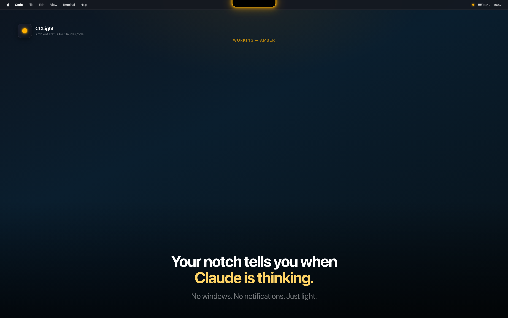
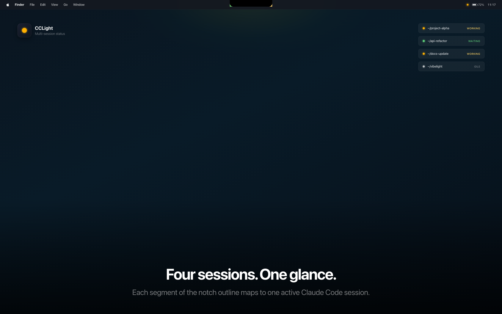
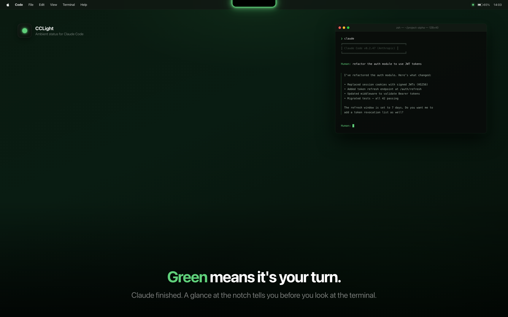
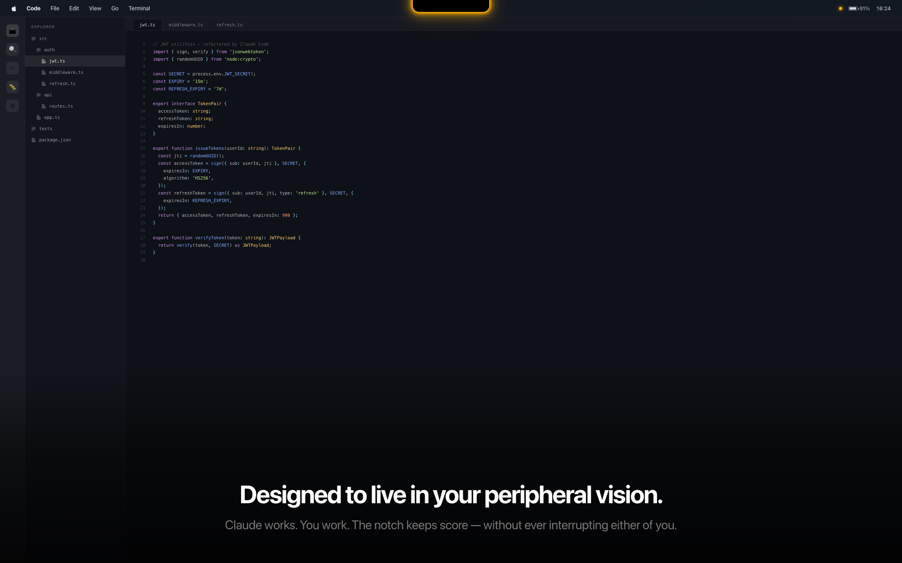
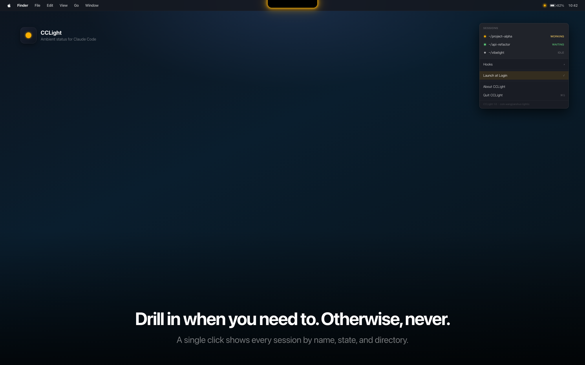
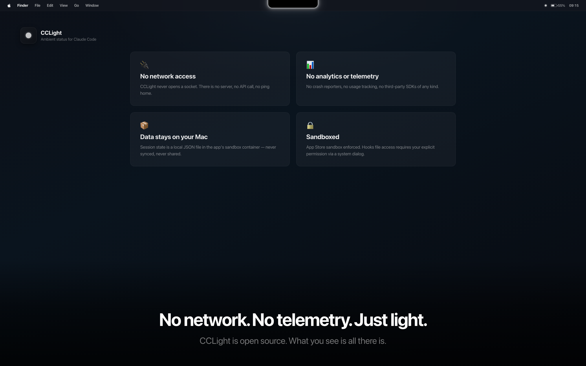

# CCLight

> Your MacBook notch tells you when Claude Code is thinking. No windows, no notifications — just light.

CCLight 把 Claude Code 的运行状态画到 MacBook 的刘海上。一道细线带着柔和的晕光环绕刘海：跑着是橙的，等你回复是绿的，闲着是白的。多个 session 同时跑？U 形分段，每段一个 session，互不打架。

<p align="center">
  <video src="marketing/cclight-promo.mp4" controls width="360" muted>
    <a href="marketing/cclight-promo.mp4">▶ marketing/cclight-promo.mp4</a>
  </video>
</p>

<sub><i>If the embed doesn't load (some markdown viewers strip `&lt;video&gt;` tags), the file is at
<a href="marketing/cclight-promo.mp4"><code>marketing/cclight-promo.mp4</code></a>
— 1080×1920, 39 s, Chinese narration + per-state chimes.</i></sub>

---

## 状态颜色

| 颜色 | 状态 | 含义 |
|---|---|---|
| 🟠 橙 `#FFB000` | **Working** | Claude 在跑 |
| 🟢 绿 `#5FCF7A` | **Waiting** | 等你输入 |
| ⚪ 白 `#FFFFFF`（淡） | **Idle** | 完成 / 闲着 |

`Waiting` 持续 5 分钟无活动 → 自动降级到 `Idle`。
任一 session 超过 10 分钟没更新 → 视为已死，自动从列表移除。

---

## 截图

### 灵动岛点亮，Claude 在干活



### 四个 session 同时跑，每段独立



### 绿色：轮到你回复



### 在余光里活着



### 需要时打开菜单，不需要就当它不存在



### 完全本地：没有网络，没有遥测



---

## 多 session

刘海下方的 U 形线分成 1–4 段，每段对应一个 session，**按打开顺序从左到右排列**。session 多于 4 个时只显示最近活跃的 4 个。每段独立着色，每段有自己的晕光。

合并后的总状态显示在菜单栏小圆点上：任一 working → 橙；否则任一 waiting → 绿；全 idle → 白。

---

## 安装

> Mac App Store 路线最终因为嵌入 CLI 的沙盒约束未走通 — 改走 Developer ID + 公证发布。
> 详见 [`scripts/archive-and-export.sh`](scripts/archive-and-export.sh)。

### 从源码构建

```bash
git clone <repo-url>
cd vibelight
open cclight.xcodeproj
# Xcode → Product → Archive，或：
bash scripts/archive-and-export.sh --dmg
```

需要本地 keychain 里有 **Developer ID Application** 证书；公证用的是 `ASC_API_KEY_ID` / `ASC_API_ISSUER_ID` / `ASC_API_KEY_CONTENT` 环境变量。

### 安装好之后

第一次启动会弹一个对话框问要不要把 hooks 写进 `~/.claude/settings.json`。选「Install」之后就生效了，不需要再做别的。

也可以手动从命令行装：

```bash
/Applications/CCLight.app/Contents/MacOS/cclightcli install-hooks
```

---

## 接入 Claude Code（hooks 做了什么）

CCLight 在 `~/.claude/settings.json` 里注册了五条 hook：

| Hook              | 调用                    |
|-------------------|------------------------|
| `SessionStart`    | `cclightcli set waiting` |
| `UserPromptSubmit`| `cclightcli set working` |
| `Stop`            | `cclightcli set waiting` |
| `Notification`    | `cclightcli set waiting` |
| `SessionEnd`      | `cclightcli clear`       |

每个 session 自己的状态写进 `~/Library/Group Containers/group.com.wangjianshuo.lightio/Library/Application Support/state.json`；CCLight 用 FSEvents 监听这个文件，状态一变灯就跟着变。

---

## 技术栈

- macOS app：SwiftUI + AppKit（`NSStatusItem`, 透明 borderless `NSWindow`, `CAShapeLayer` 多层 glow halo）
- 状态：`FSEventStream` 监听 JSON state file
- CLI：Swift Package Manager（`CCLightCore` 共享逻辑库 + `cclightcli` 可执行）
- 通信：App Group container（`group.com.wangjianshuo.lightio`），App 沙盒 + 非沙盒 CLI 共享同一份 `state.json`
- 分发：Developer ID Application 签名 + Apple 公证 + stapler 钉印

刘海几何：自动检测 `NSScreen.safeAreaInsets` + `auxiliaryTopLeftArea/RightArea`。
U 形 path：右侧↓ → 右下圆角弧 → 底部← → 左下圆角弧 → 左侧↑，5 层 `CAShapeLayer` 叠加（line + glow1 r=6 + glow2 r=14 + glow3 r=28 + glow4 r=50 + glow5 r=80）。

---

## Repo 结构

```
cclight/                 — macOS app target (Swift / AppKit)
  AppDelegate.swift       — wires StateStore + overlay + menu bar + first-run
  StateStore.swift        — FSEvents watcher, 5-min idle timer
  NotchOverlayView.swift  — CAShapeLayer-based glow rendering
  NotchOverlayWindow.swift— borderless transparent click-through window
  MenuBarController.swift — NSStatusItem dot + session menu
  FirstRun.swift          — symlink, hooks dialog, launch-at-login
  cclight.entitlements    — sandbox + app-group + user-selected files

cclight-cli/             — Swift Package
  Sources/CCLightCore/   — shared library (paths, state JSON, hook installer)
  Sources/cclight/main.swift — embedded CLI (set / clear / status / install-hooks)

cclight.xcodeproj/       — Xcode workspace

scripts/
  archive-and-export.sh   — Developer ID archive + notarize + staple (+ optional DMG)
  ExportOptions.plist     — xcodebuild export config (developer-id)

marketing/
  cclight-promo.mp4           — vertical promo (1080×1920, 26 s)
  cclight-promo-landscape.mp4 — landscape promo (1920×1080, 26 s)
  screenshots/                — App Store screenshot variants (v1–v6 HTML + PNG)
  appstore-metadata.md        — (legacy; from the App Store attempt)

docs/
  privacy.md              — privacy policy
  superpowers/            — design notes from v1
```

---

## License

Personal project, all rights reserved.

由 [王建硕](https://wangjianshuo.com) 在 2026 年 5 月制作。
